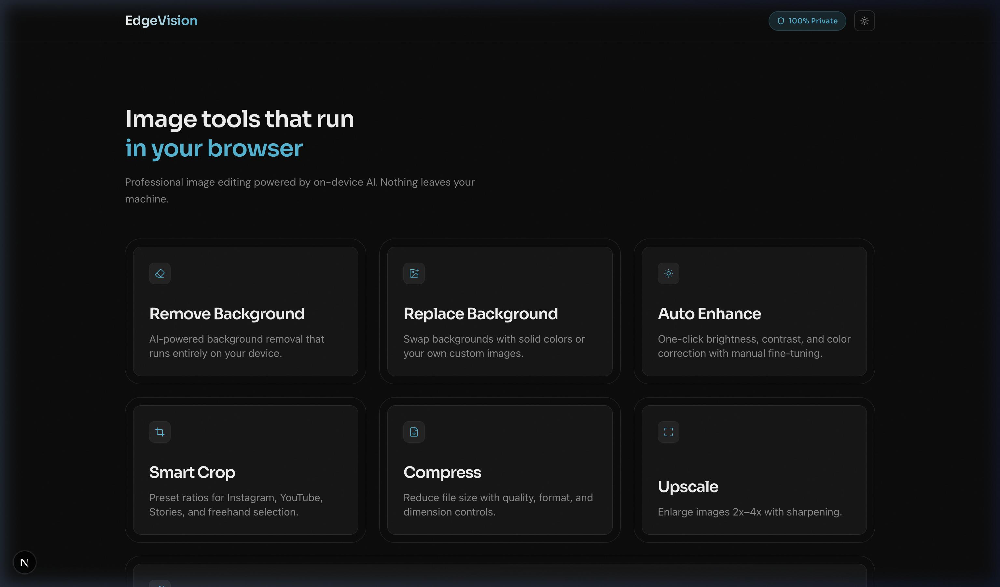
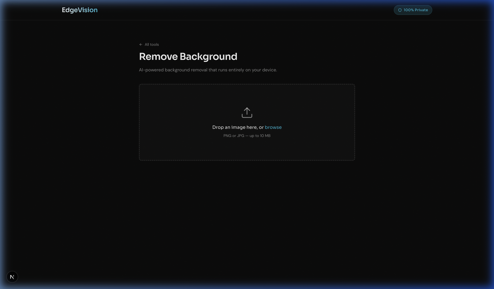

# EdgeVision

I built EdgeVision because I was annoyed by having to upload my images to random third-party servers just to remove a background or compress them. This is a suite of 7 image editing tools that run **100% locally in your browser**.

There are no servers, no tracking, no paywalls, and no need to sign up to unlock any "premium" features. All the AI inference and image processing is handled directly on your own device using WebAssembly (WASM) and local canvas manipulation.




## The Tools

- **Remove Background**: AI-powered background removal running entirely in-memory.
- **Replace Background**: Swap backgrounds with solid colors or your own custom images.
- **Auto Enhance**: One-click brightness, contrast, and color correction.
- **Smart Crop**: Aspect ratio presets for social media and freehand cropping.
- **Compress**: File size reduction with quality, format, and dimension controls.
- **Upscale**: Enlarge images 2x-4x natively in the browser.
- **Denoise**: Remove grain and noise from photos.

## Why I Built This

I wanted to prove that heavy AI processing doesn't need to be offloaded to an expensive cloud GPU anymore. Modern browsers are incredibly powerful, and by compiling logic down to WebAssembly, you can run entire neural networks right on the client. It completely sidesteps server costs and guarantees user privacy because the image data never leaves the machine.

## Technical Challenges & Engineering Solutions

Building an AI tool that runs strictly client-side wasn't as straightforward as I hoped. Here are the biggest hurdles I ran into and how I solved them:

### 1. Hydration Mismatch Hell

In Next.js, implementing a true light/dark mode without a "flicker" on load is notoriously annoying. I initially tried forcing a `.dark` class via React state, but React's hydration would immediately overwrite the DOM and break the toggle.
**The fix:** I stripped React's control of the HTML class entirely and injected a vanilla inline `<script>` into the document `<head>` to read `localStorage` and set the theme before the DOM even parsed.

### 2. Main-Thread Bottlenecks

Running a neural network in the browser is heavy computationally. At first, the entire UI would freeze for 3-5 seconds while processing an image, which felt terrible.
**The fix:** I moved the heavy ML inference into a Web Worker system. Doing the math on a background thread keeps the main UI running cleanly at 60 FPS. You can still interact with the app while the image is processing in the background.

### 3. Memory Management

The AI models are about ~40MB. Downloading them on every single page load would destroy performance and eat up user bandwidth.
**The fix:** I built a caching layer using Service Workers and the Cache Storage API. You download the model once, and it's locally cached. The next time you visit, it's a near-instant "warm start." I also strictly use `URL.createObjectURL` for image previews rather than base64 strings to prevent massive memory leaks.

### 4. Background Web Worker Preloading

The AI model for background removal is heavy. If I waited for a user to upload an image to start downloading the model, the app would feel broken.
**The fix:** The model begins silently preloading in a Web Worker the second you land on the home page. By the time you actually navigate to the "Remove Background" tool and drop an image, the model is already "warm" in memory, making the inference feel instant.

## Running Locally

Clone the repo, install dependencies, and run the development server:

```bash
npm install
npm run dev
```

Open `http://localhost:3000` to see the app running locally.

## Testing

EdgeVision uses [Playwright](https://playwright.dev/) for automated End-to-End (E2E) testing to ensure UI stability across Chromium and WebKit.

To run the test suite locally:

```bash
# Install the required Playwright browsers (first time only)
npx playwright install --with-deps

# Run the UI tests
npm run test:e2e
```
